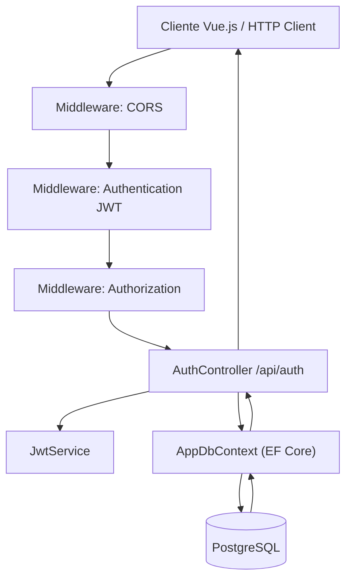

# 02 - Arquitetura

## Diagrama de Fluxo



## Pipeline HTTP

A ordem de execucao dos middlewares em `Program.cs`:

```
1. app.UseSwagger()
2. app.UseSwaggerUI()
3. app.UseHttpsRedirection()
4. app.UseCors("VuePolicy")
5. app.UseAuthentication()
6. app.UseAuthorization()
7. app.MapControllers()
```

```
HTTP Request
    |
    v
[Swagger] -- apenas em dev, documenta endpoints
    |
    v
[HTTPS Redirection] -- redireciona HTTP para HTTPS
    |
    v
[CORS] -- "VuePolicy": AllowAnyOrigin, AllowAnyHeader, AllowAnyMethod
    |
    v
[JWT Authentication] -- valida token JWT do header Authorization: Bearer {token}
    |
    v
[Authorization] -- verifica atributo [Authorize] nos endpoints
    |
    v
[Controller] -- AuthController processa a requisicao
    |
    v
[AppDbContext / PostgreSQL] -- acesso ao banco de dados
    |
    v
[Controller] -- retorna IActionResult
    |
    v
HTTP Response
```

## Responsabilidades de Cada Camada

### Program.cs (Entry Point / Composition Root)

- Configura **servicos** (DI container): Controllers, Swagger, JwtService, CORS, Authentication, DbContext
- Configura **middleware pipeline**: Swagger, HTTPS, CORS, Auth, Controllers
- Registra politicas de CORS (`VuePolicy`)
- Configura autenticacao JWT com parametros de validacao
- Configura EF Core com PostgreSQL (Npgsql)

### Controller (AuthController)

Arquivo: `app/Controllers/Auth/AuthController.cs`

- **Rota base**: `[Route("api/auth")]`
- **Atributo**: `[ApiController]` -- validacao automatica de ModelState
- **Dependencias injetadas**: `JwtService`, `AppDbContext`
- Contem TODA a logica de negocio do sistema
- Acessa `AppDbContext` diretamente (nao ha camada Repository)
- Metodo privado auxiliar: `GenerateRefreshToken()` para gerar refresh tokens criptograficos
- **13 endpoints**: 3 publicos (login, register, refresh) + 10 autenticados
- Retorna objetos anonimos como resposta (nao ha DTOs de response tipados em muitos casos)
- Usa soft delete (seta `DeletedAt`) em vez de remocao fisica

### Service (JwtService)

Arquivo: `app/Services/JwtService.cs`

- Metodo unico: `GenerateToken(string email, Guid userId)`
- Gera token JWT com claims: `ClaimTypes.NameIdentifier` (userId) e `ClaimTypes.Email` (email)
- Expiracao: 2 horas
- Algoritmo: HMAC-SHA256
- Unico servico separado do controller. Demais logicas de negocio estao no proprio controller.

### Data (AppDbContext)

Arquivo: `Data/AppDbContext.cs`

- DbContext do Entity Framework Core
- Configura relacionamentos via Fluent API no `OnModelCreating`
- **6 DbSets**: `Users`, `RefreshTokens`, `Events`, `EventParticipants`, `Calendar`, `CalendarParticipant`
- Aplica **Global Query Filters** para soft delete em todas as entidades (`DeletedAt == null`)

### Database (PostgreSQL)

- Banco cliente-servidor: PostgreSQL
- Conexao via `Npgsql.EntityFrameworkCore.PostgreSQL`
- Tabelas: `Users`, `RefreshTokens`, `Events`, `EventParticipants`, `Calendar`, `CalendarParticipant`
- Sem procedures, sem views, sem triggers

## Injecao de Dependencias

| Servico | Tempo de Vida | Justificativa |
|---|---|---|
| `JwtService` | **Scoped** | Uma instancia por request, mesmo ciclo de vida do DbContext |
| `AppDbContext` | **Scoped** (padrao EF Core) | Uma instancia por request |
| Controllers | **Transient** (padrao) | Adicionados via `builder.Services.AddControllers()` |

Registro em `Program.cs`:

```csharp
builder.Services.AddControllers();
builder.Services.AddScoped<JwtService>();
builder.Services.AddDbContext<AppDbContext>(options =>
{
    options.UseNpgsql(
        builder.Configuration.GetConnectionString("DefaultConnection")
    );
});
```

## Separacao de Responsabilidades

O projeto **nao segue** uma arquitetura em camadas rigorosa (Clean Architecture, Onion, etc.). E uma arquitetura MVC simplificada onde:

- Controller **conhece** o DbContext diretamente
- Controller **contem** logica de negocio
- Nao ha camada Repository
- Nao ha camada Service separada para regras de negocio (exceto JwtService)
- Nao ha DTOs de response tipados de forma consistente (usa objetos anonimos em muitos endpoints)

## Organizacao das Pastas

| Pasta | Responsabilidade |
|---|---|
| `Data/` | DbContext do EF Core |
| `app/Controllers/Auth/` | Controller unico com todos endpoints |
| `app/entities/` | Entidades de dominio (User, Event, Calendar, RefreshToken e entidades de juncao) |
| `app/Modals/` | DTOs de request e response (nome com typo: "Modals" em vez de "Models") |
| `app/Services/` | Servico de geracao de JWT |
| `app/utils/` | Constantes de acao (codigos de erro/sucesso) |
| `Migrations/` | Migrations geradas pelo EF Core |
| `Properties/` | Configuracoes de launch |
