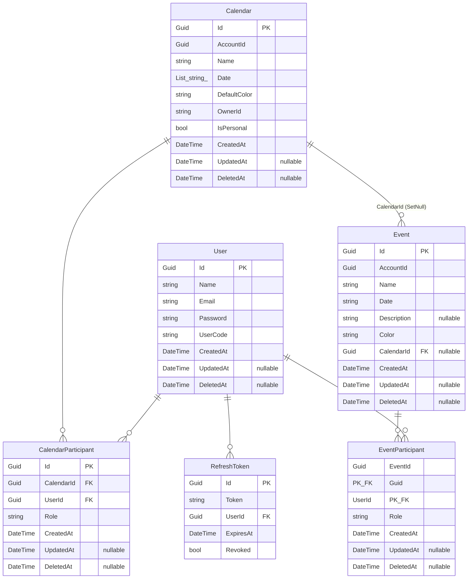

# 05 - Entidades

## Diagrama ER (Mermaid)



---

## User (Usuario)

**Namespace**: `AgenderBackend.Api.Models`
**Arquivo**: `app/entities/User.cs:6`
**Tabela**: `Users`
**Indice unico**: `(Name, UserCode)`

```csharp
[Index(nameof(Name), nameof(UserCode), IsUnique = true)]
public class User
{
    public Guid Id { get; set; }
    public string Name { get; set; } = string.Empty;
    public string Email { get; set; } = string.Empty;
    public string Password { get; set; } = string.Empty;
    public string UserCode { get; set; } = string.Empty;
    public DateTime CreatedAt { get; set; }
    public DateTime? UpdatedAt { get; set; }
    public DateTime? DeletedAt { get; set; }
    public List<CalendarParticipant> CalendarParticipants { get; set; } = [];
}
```

### Propriedades

| Propriedade | Tipo | Obrigatorio | Descricao |
|---|---|---|---|
| `Id` | `Guid` | Sim (PK) | Identificador unico |
| `Name` | `string` | Sim | Nome do usuario |
| `Email` | `string` | Sim | Email (usado para login) |
| `Password` | `string` | Sim | Senha em texto puro (sem hash!) |
| `UserCode` | `string` | Sim | Codigo de 4 digitos gerado aleatoriamente |
| `CreatedAt` | `DateTime` | Sim | Data de criacao |
| `UpdatedAt` | `DateTime?` | Nao | Data de atualizacao |
| `DeletedAt` | `DateTime?` | Nao | Data de exclusao logica (soft delete) |

### Navegacoes

| Propriedade | Tipo | Relacionamento |
|---|---|---|
| `CalendarParticipants` | `List<CalendarParticipant>` | One-to-Many com `CalendarParticipant` |

### Constraints

- `Id`: Primary Key
- `(Name, UserCode)`: Indice unico composto
- Global Query Filter: `u.DeletedAt == null`

---

## Calendar (Calendario)

**Arquivo**: `app/entities/Calendar.cs:3`
**Tabela**: `Calendar`

```csharp
public class Calendar
{
    public Guid Id { get; set; }
    public Guid AccountId { get; set; }
    public string Name { get; set; } = string.Empty;
    public List<string> Date { get; set; } = [];
    public string DefaultColor { get; set; } = "#653294";
    public string OwnerId { get; set; } = string.Empty;
    public bool IsPersonal { get; set; }
    public DateTime CreatedAt { get; set; }
    public DateTime? UpdatedAt { get; set; }
    public DateTime? DeletedAt { get; set; }
    public List<CalendarParticipant> CalendarParticipants { get; set; } = [];
}
```

### Propriedades

| Propriedade | Tipo | Obrigatorio | Descricao |
|---|---|---|---|
| `Id` | `Guid` | Sim (PK) | Identificador unico |
| `AccountId` | `Guid` | Sim | ID do criador |
| `Name` | `string` | Sim | Nome do calendario |
| `Date` | `List<string>` | Sim | Lista de datas (armazenada como `text[]` no PostgreSQL) |
| `DefaultColor` | `string` | Sim | Cor padrao em hexadecimal (ex: `#653294`) |
| `OwnerId` | `string` | Sim | ID do dono como string |
| `IsPersonal` | `bool` | Sim | Indica se e calendario pessoal automatico |
| `CreatedAt` | `DateTime` | Sim | Data de criacao |
| `UpdatedAt` | `DateTime?` | Nao | Data de atualizacao |
| `DeletedAt` | `DateTime?` | Nao | Data de exclusao logica |

### Navegacoes

| Propriedade | Tipo | Relacionamento |
|---|---|---|
| `CalendarParticipants` | `List<CalendarParticipant>` | One-to-Many com `CalendarParticipant` |

### Constraints

- `Id`: Primary Key
- `CalendarId` em `Event`: FK com `OnDelete(DeleteBehavior.SetNull)`
- Global Query Filter: `c.DeletedAt == null`

---

## CalendarParticipant (Participante de Calendario)

**Arquivo**: `app/entities/Calendar.cs:19`
**Tabela**: `CalendarParticipant`
**Indice unico**: `(CalendarId, UserId)`

```csharp
public class CalendarParticipant
{
    public Guid Id { get; set; }
    public Guid CalendarId { get; set; }
    public Calendar Calendar { get; set; } = null!;
    public Guid UserId { get; set; }
    public User User { get; set; } = null!;
    public DateTime CreatedAt { get; set; }
    public DateTime? UpdatedAt { get; set; }
    public DateTime? DeletedAt { get; set; }
    public string Role { get; set; } = "Member";
}
```

### Propriedades

| Propriedade | Tipo | Obrigatorio | Descricao |
|---|---|---|---|
| `Id` | `Guid` | Sim (PK proprio) | Identificador unico |
| `CalendarId` | `Guid` | Sim (FK) | ID do calendario |
| `UserId` | `Guid` | Sim (FK) | ID do usuario |
| `Role` | `string` | Sim | "Owner" ou "Member" |
| `CreatedAt` | `DateTime` | Sim | Data de criacao |
| `UpdatedAt` | `DateTime?` | Nao | Data de atualizacao |
| `DeletedAt` | `DateTime?` | Nao | Data de exclusao logica |

### Navegacoes

| Propriedade | Tipo | Relacionamento |
|---|---|---|
| `Calendar` | `Calendar` | Many-to-One com `Calendar` |
| `User` | `User` | Many-to-One com `User` |

### Constraints

- `Id`: Primary Key proprio (diferente de `EventParticipant`)
- `(CalendarId, UserId)`: Indice unico composto
- FK `CalendarId` -> `Calendar`: Cascade delete
- FK `UserId` -> `User`: Cascade delete
- Global Query Filter: `cp.DeletedAt == null`

### Relacionamentos

```
Calendar (1) ---> (*) CalendarParticipant (*) <--- (1) User
```

---

## Event (Evento)

**Arquivo**: `app/entities/Event.cs:3`
**Tabela**: `Events`

```csharp
public class Event
{
    public Guid Id { get; set; }
    public Guid AccountId { get; set; }
    public string Name { get; set; } = string.Empty;
    public string Date { get; set; } = string.Empty;
    public string? Description { get; set; }
    public string Color { get; set; } = "#653294";
    public Guid? CalendarId { get; set; }
    public Calendar? Calendar { get; set; }
    public DateTime CreatedAt { get; set; }
    public DateTime? UpdatedAt { get; set; }
    public DateTime? DeletedAt { get; set; }
    public List<EventParticipant> Participants { get; set; } = [];
}
```

### Propriedades

| Propriedade | Tipo | Obrigatorio | Descricao |
|---|---|---|---|
| `Id` | `Guid` | Sim (PK) | Identificador unico |
| `AccountId` | `Guid` | Sim | ID do criador |
| `Name` | `string` | Sim | Nome do evento |
| `Date` | `string` | Sim | Data no formato `DD/MM/YYYY` |
| `Description` | `string?` | Nao | Descricao do evento |
| `Color` | `string` | Sim | Cor em hexadecimal (ex: `#653294`) |
| `CalendarId` | `Guid?` | Nao (FK nullable) | ID do calendario (se pertencer a um) |
| `CreatedAt` | `DateTime` | Sim | Data de criacao |
| `UpdatedAt` | `DateTime?` | Nao | Data de atualizacao |
| `DeletedAt` | `DateTime?` | Nao | Data de exclusao logica |

### Navegacoes

| Propriedade | Tipo | Relacionamento |
|---|---|---|
| `Calendar` | `Calendar?` | Many-to-One com `Calendar` (nullable) |
| `Participants` | `List<EventParticipant>` | One-to-Many com `EventParticipant` |

### Constraints

- `Id`: Primary Key
- FK `CalendarId` -> `Calendar`: `OnDelete(DeleteBehavior.SetNull)` -- ao deletar calendario, `CalendarId` do evento vira null
- Global Query Filter: `e.DeletedAt == null`

---

## EventParticipant (Participante de Evento)

**Arquivo**: `app/entities/Event.cs:20`
**Tabela**: `EventParticipants`
**Chave composta**: `(EventId, UserId)`

```csharp
public class EventParticipant
{
    public Guid EventId { get; set; }
    public Event Event { get; set; } = null!;
    public Guid UserId { get; set; }
    public User User { get; set; } = null!;
    public string Role { get; set; } = "Member";
    public DateTime CreatedAt { get; set; }
    public DateTime? UpdatedAt { get; set; }
    public DateTime? DeletedAt { get; set; }
}
```

### Propriedades

| Propriedade | Tipo | Obrigatorio | Descricao |
|---|---|---|---|
| `EventId` | `Guid` | Sim (PK/FK composta) | ID do evento |
| `UserId` | `Guid` | Sim (PK/FK composta) | ID do usuario |
| `Role` | `string` | Sim | "Owner" ou "Member" |
| `CreatedAt` | `DateTime` | Sim | Data de criacao |
| `UpdatedAt` | `DateTime?` | Nao | Data de atualizacao |
| `DeletedAt` | `DateTime?` | Nao | Data de exclusao logica |

### Navegacoes

| Propriedade | Tipo | Relacionamento |
|---|---|---|
| `Event` | `Event` | Many-to-One com `Event` |
| `User` | `User` | Many-to-One com `User` |

### Constraints

- **Chave composta**: `(EventId, UserId)` -- sem Id proprio
- FK `EventId` -> `Event`: Cascade delete
- FK `UserId` -> `User`: Cascade delete
- Global Query Filter: `ep.DeletedAt == null`

### Relacionamentos

```
Event (1) ---> (*) EventParticipant (*) <--- (1) User
```

### Diferenca entre EventParticipant e CalendarParticipant

| Caracteristica | EventParticipant | CalendarParticipant |
|---|---|---|
| Chave primaria | Composta `(EventId, UserId)` | Própria `Id` (Guid) |
| Indice unico | Implicito pela PK composta | Explicito `(CalendarId, UserId)` |
| Configuracao | Via `HasKey(ep => new { ep.EventId, ep.UserId })` | `HasKey(cp => cp.Id)` + `HasIndex(...).IsUnique()` |

---

## RefreshToken

**Arquivo**: `app/entities/RefreshToken.cs:5`
**Tabela**: `RefreshTokens`

```csharp
public class RefreshToken
{
    [Key]
    public Guid Id { get; set; } = Guid.NewGuid();
    public string Token { get; set; } = string.Empty;
    public Guid UserId { get; set; }
    public User User { get; set; } = null!;
    public DateTime ExpiresAt { get; set; }
    public bool Revoked { get; set; }
}
```

### Propriedades

| Propriedade | Tipo | Obrigatorio | Descricao |
|---|---|---|---|
| `Id` | `Guid` | Sim (PK) | Identificador unico |
| `Token` | `string` | Sim | Token Base64 (64 bytes aleatorios) |
| `UserId` | `Guid` | Sim (FK) | ID do usuario |
| `ExpiresAt` | `DateTime` | Sim | Data de expiracao (7 dias) |
| `Revoked` | `bool` | Sim | Indica se foi revogado |

### Navegacoes

| Propriedade | Tipo | Relacionamento |
|---|---|---|
| `User` | `User` | Many-to-One com `User` |

### Constraints

- `Id`: Primary Key (com `[Key]` DataAnnotation)
- FK `UserId` -> `User`: Cascade delete
- **Sem** Global Query Filter (nao tem `DeletedAt`)

---

## Resumo de Relacionamentos

### One-to-Many

| Entidade Principal | Entidade Dependente | FK |
|---|---|---|
| `User` | `CalendarParticipant` | `UserId` |
| `User` | `EventParticipant` | `UserId` |
| `User` | `RefreshToken` | `UserId` |
| `Calendar` | `CalendarParticipant` | `CalendarId` |
| `Calendar` | `Event` | `CalendarId` (nullable, SetNull on delete) |
| `Event` | `EventParticipant` | `EventId` |

### Many-to-Many

- **User <-> Calendar**: Via `CalendarParticipant` (tabela de juncao com `Id` proprio)
- **User <-> Event**: Via `EventParticipant` (tabela de juncao com chave composta)

### One-to-One

Nao encontrado.

### Comportamento de Delete

| Relacionamento | OnDelete |
|---|---|
| `CalendarParticipant` -> `Calendar` | **Cascade** |
| `CalendarParticipant` -> `User` | **Cascade** |
| `EventParticipant` -> `Event` | **Cascade** |
| `EventParticipant` -> `User` | **Cascade** |
| `RefreshToken` -> `User` | **Cascade** |
| `Event` -> `Calendar` | **SetNull** |

**Observacao importante**: Como o sistema usa soft delete (Global Query Filters com `DeletedAt`), o cascade delete do EF Core so seria acionado em remocoes fisicas (`context.Remove()`), que **nao sao usadas** nos endpoints atuais.

---

## Soft Delete

Todas as entidades exceto `RefreshToken` possuem o campo `DeletedAt`. O `AppDbContext` aplica Global Query Filters:

```csharp
modelBuilder.Entity<User>().HasQueryFilter(u => u.DeletedAt == null);
modelBuilder.Entity<Calendar>().HasQueryFilter(c => c.DeletedAt == null);
modelBuilder.Entity<CalendarParticipant>().HasQueryFilter(cp => cp.DeletedAt == null);
modelBuilder.Entity<Event>().HasQueryFilter(e => e.DeletedAt == null);
modelBuilder.Entity<EventParticipant>().HasQueryFilter(ep => ep.DeletedAt == null);
```

Isso significa que registros com `DeletedAt != null` sao automaticamente excluidos de todas as queries, simulando uma exclusao logica.
