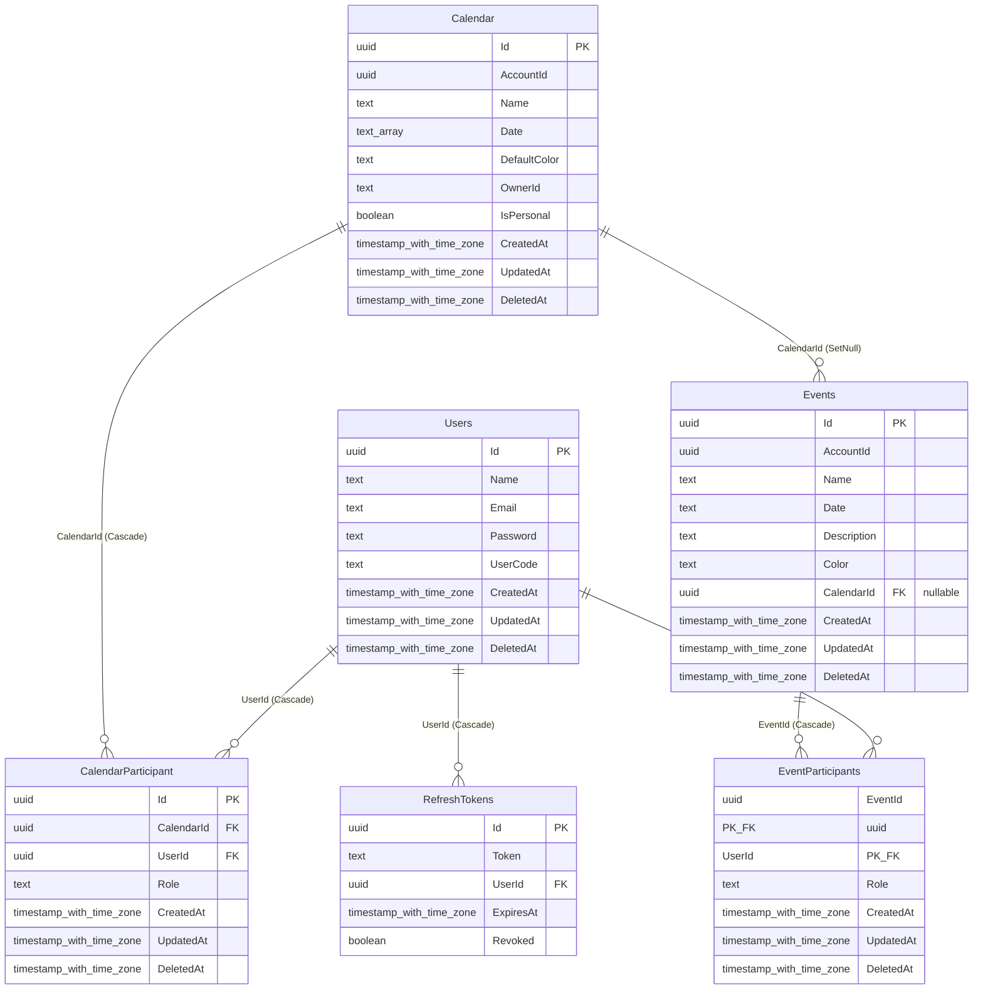

# 09 - Database

## Banco Utilizado

- **SGBD**: PostgreSQL
- **Provider EF Core**: `Npgsql.EntityFrameworkCore.PostgreSQL` v10.0.2
- **Connection String via**: `IConfiguration` + variaveis de ambiente
- **Modelo**: Cliente-servidor, banco de dados externo

## Connection String

```json
// appsettings.json
"ConnectionStrings": {
    "DefaultConnection": "Host=localhost;Port=5432;Database=agender;Username=postgres;Password=postgres"
}
```

### Prioridade de Connection String

1. Variavel de ambiente: `ConnectionStrings__DefaultConnection`
2. `appsettings.Development.json`
3. `appsettings.json`

## Registro no Program.cs

```csharp
builder.Services.AddDbContext<AppDbContext>(options =>
{
    options.UseNpgsql(
        builder.Configuration.GetConnectionString("DefaultConnection")
    );
});
```

---

## DbContext

**Arquivo**: `Data/AppDbContext.cs`
**Classe**: `AppDbContext`

### DbSets

| DbSet | Tipo | Tabela |
|---|---|---|
| `Users` | `DbSet<User>` | `Users` |
| `RefreshTokens` | `DbSet<RefreshToken>` | `RefreshTokens` |
| `Events` | `DbSet<Event>` | `Events` |
| `EventParticipants` | `DbSet<EventParticipant>` | `EventParticipants` |
| `Calendar` | `DbSet<Calendar>` | `Calendar` |
| `CalendarParticipant` | `DbSet<CalendarParticipant>` | `CalendarParticipant` |

### Configuracao Fluent API (OnModelCreating)

```csharp
protected override void OnModelCreating(ModelBuilder modelBuilder)
{
    base.OnModelCreating(modelBuilder);

    // EventParticipant: chave composta
    modelBuilder.Entity<EventParticipant>()
        .HasKey(ep => new { ep.EventId, ep.UserId });

    modelBuilder.Entity<EventParticipant>()
        .HasOne(ep => ep.Event)
        .WithMany(e => e.Participants)
        .HasForeignKey(ep => ep.EventId);

    modelBuilder.Entity<EventParticipant>()
        .HasOne(ep => ep.User)
        .WithMany()
        .HasForeignKey(ep => ep.UserId);

    // CalendarParticipant: chave propria + indice unico
    modelBuilder.Entity<CalendarParticipant>()
        .HasKey(cp => cp.Id);

    modelBuilder.Entity<CalendarParticipant>()
        .HasOne(cp => cp.Calendar)
        .WithMany(c => c.CalendarParticipants)
        .HasForeignKey(cp => cp.CalendarId);

    modelBuilder.Entity<CalendarParticipant>()
        .HasOne(cp => cp.User)
        .WithMany(u => u.CalendarParticipants)
        .HasForeignKey(cp => cp.UserId);

    modelBuilder.Entity<CalendarParticipant>()
        .HasIndex(cp => new { cp.CalendarId, cp.UserId })
        .IsUnique();

    // Event -> Calendar: SetNull on delete
    modelBuilder.Entity<Event>()
        .HasOne(e => e.Calendar)
        .WithMany()
        .HasForeignKey(e => e.CalendarId)
        .OnDelete(DeleteBehavior.SetNull);

    // Global Query Filters (soft delete)
    modelBuilder.Entity<User>().HasQueryFilter(u => u.DeletedAt == null);
    modelBuilder.Entity<Calendar>().HasQueryFilter(c => c.DeletedAt == null);
    modelBuilder.Entity<CalendarParticipant>().HasQueryFilter(cp => cp.DeletedAt == null);
    modelBuilder.Entity<Event>().HasQueryFilter(e => e.DeletedAt == null);
    modelBuilder.Entity<EventParticipant>().HasQueryFilter(ep => ep.DeletedAt == null);
}
```

---

## Esquema do Banco

### Tabela: Users

| Coluna | Tipo PostgreSQL | Nullable | Descricao |
|---|---|---|---|
| `Id` | uuid | NOT NULL | Primary Key |
| `Name` | text | NOT NULL | Nome do usuario |
| `Email` | text | NOT NULL | Email |
| `Password` | text | NOT NULL | Senha (texto puro) |
| `UserCode` | text | NOT NULL | Codigo 4 digitos |
| `CreatedAt` | timestamp with time zone | NOT NULL | Data de criacao |
| `UpdatedAt` | timestamp with time zone | NULL | Data de atualizacao |
| `DeletedAt` | timestamp with time zone | NULL | Soft delete |

**Indices**:
- `PK_Users`: `Id` (PRIMARY KEY)
- `IX_Users_Name_UserCode`: `(Name, UserCode)` UNIQUE

### Tabela: Calendar

| Coluna | Tipo PostgreSQL | Nullable | Descricao |
|---|---|---|---|
| `Id` | uuid | NOT NULL | Primary Key |
| `AccountId` | uuid | NOT NULL | ID do criador |
| `Name` | text | NOT NULL | Nome |
| `Date` | text[] | NOT NULL | Lista de datas (array) |
| `DefaultColor` | text | NOT NULL | Cor padrao hex |
| `OwnerId` | text | NOT NULL | ID do dono (string) |
| `IsPersonal` | boolean | NOT NULL | Calendario pessoal |
| `CreatedAt` | timestamp with time zone | NOT NULL | Data de criacao |
| `UpdatedAt` | timestamp with time zone | NULL | Data de atualizacao |
| `DeletedAt` | timestamp with time zone | NULL | Soft delete |

**Indices**:
- `PK_Calendar`: `Id` (PRIMARY KEY)

### Tabela: CalendarParticipant

| Coluna | Tipo PostgreSQL | Nullable | Descricao |
|---|---|---|---|
| `Id` | uuid | NOT NULL | Primary Key |
| `CalendarId` | uuid | NOT NULL | FK -> Calendar |
| `UserId` | uuid | NOT NULL | FK -> Users |
| `Role` | text | NOT NULL | "Owner" / "Member" |
| `CreatedAt` | timestamp with time zone | NOT NULL | Data de criacao |
| `UpdatedAt` | timestamp with time zone | NULL | Data de atualizacao |
| `DeletedAt` | timestamp with time zone | NULL | Soft delete |

**Indices**:
- `PK_CalendarParticipant`: `Id` (PRIMARY KEY)
- `IX_CalendarParticipant_UserId`: `UserId`
- `IX_CalendarParticipant_CalendarId_UserId`: `(CalendarId, UserId)` UNIQUE

**Foreign Keys**:
- `FK_CalendarParticipant_Calendar_CalendarId`: `CalendarId` -> `Calendar(Id)` ON DELETE CASCADE
- `FK_CalendarParticipant_Users_UserId`: `UserId` -> `Users(Id)` ON DELETE CASCADE

### Tabela: Events

| Coluna | Tipo PostgreSQL | Nullable | Descricao |
|---|---|---|---|
| `Id` | uuid | NOT NULL | Primary Key |
| `AccountId` | uuid | NOT NULL | ID do criador |
| `Name` | text | NOT NULL | Nome do evento |
| `Date` | text | NOT NULL | Data `DD/MM/YYYY` |
| `Description` | text | NULL | Descricao |
| `Color` | text | NOT NULL | Cor hex |
| `CalendarId` | uuid | NULL | FK -> Calendar |
| `CreatedAt` | timestamp with time zone | NOT NULL | Data de criacao |
| `UpdatedAt` | timestamp with time zone | NULL | Data de atualizacao |
| `DeletedAt` | timestamp with time zone | NULL | Soft delete |

**Indices**:
- `PK_Events`: `Id` (PRIMARY KEY)
- `IX_Events_CalendarId`: `CalendarId`

**Foreign Keys**:
- `FK_Events_Calendar_CalendarId`: `CalendarId` -> `Calendar(Id)` ON DELETE SET NULL

### Tabela: EventParticipants

| Coluna | Tipo PostgreSQL | Nullable | Descricao |
|---|---|---|---|
| `EventId` | uuid | NOT NULL | PK composta / FK -> Events |
| `UserId` | uuid | NOT NULL | PK composta / FK -> Users |
| `Role` | text | NOT NULL | "Owner" / "Member" |
| `CreatedAt` | timestamp with time zone | NOT NULL | Data de criacao |
| `UpdatedAt` | timestamp with time zone | NULL | Data de atualizacao |
| `DeletedAt` | timestamp with time zone | NULL | Soft delete |

**Indices**:
- `PK_EventParticipants`: `(EventId, UserId)` (COMPOSITE PRIMARY KEY)
- `IX_EventParticipants_UserId`: `UserId`

**Foreign Keys**:
- `FK_EventParticipants_Events_EventId`: `EventId` -> `Events(Id)` ON DELETE CASCADE
- `FK_EventParticipants_Users_UserId`: `UserId` -> `Users(Id)` ON DELETE CASCADE

### Tabela: RefreshTokens

| Coluna | Tipo PostgreSQL | Nullable | Descricao |
|---|---|---|---|
| `Id` | uuid | NOT NULL | Primary Key |
| `Token` | text | NOT NULL | Token Base64 |
| `UserId` | uuid | NOT NULL | FK -> Users |
| `ExpiresAt` | timestamp with time zone | NOT NULL | Data de expiracao |
| `Revoked` | boolean | NOT NULL | Revogado |

**Indices**:
- `PK_RefreshTokens`: `Id` (PRIMARY KEY)
- `IX_RefreshTokens_UserId`: `UserId`

**Foreign Keys**:
- `FK_RefreshTokens_Users_UserId`: `UserId` -> `Users(Id)` ON DELETE CASCADE

---

## Cascade Delete

| Tabela Origem | Tabela Destino | FK | OnDelete |
|---|---|---|---|
| CalendarParticipant | Calendar | CalendarId | **Cascade** |
| CalendarParticipant | Users | UserId | **Cascade** |
| EventParticipants | Events | EventId | **Cascade** |
| EventParticipants | Users | UserId | **Cascade** |
| RefreshTokens | Users | UserId | **Cascade** |
| Events | Calendar | CalendarId | **SetNull** |

**Nota**: O cascade delete do EF Core so e acionado com `context.Remove()`. Como o sistema usa soft delete (`DeletedAt`), as remocoes fisicas nao ocorrem nos endpoints atuais.

---

## Migrations

### Historico de Migrations (1 migration)

| # | Nome | Data | Descricao |
|---|---|---|---|
| 1 | `20260703000000_InitialCreate` | 03/07/2026 | Criacao inicial do banco para PostgreSQL |

### Comando para gerar migration

```bash
dotnet ef migrations add NomeDaMigration
```

### Comando para aplicar migrations

```bash
dotnet ef database update
```

---

## Seeds

**Nao encontrado**. Nao ha dados de seed (metodo `HasData` no `OnModelCreating`, classes de seed, ou inicializadores).

---

## Diagrama ER (Mermaid)


