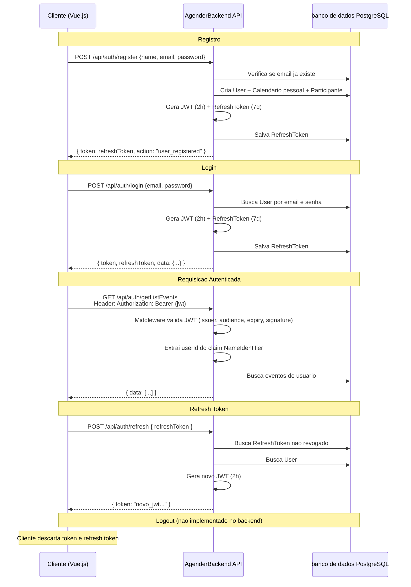

# 10 - Autenticacao e Autorizacao

## Mecanismo de Autenticacao

O projeto utiliza **JWT Bearer Token** como mecanismo de autenticacao.

### Pacote

```
Microsoft.AspNetCore.Authentication.JwtBearer v10.0.9
```

### Configuracao JWT (appsettings.json)

```json
"Jwt": {
    "Key": "minha-chave-super-secreta-com-pelo-menos-32-caracteres",
    "Issuer": "Agender",
    "Audience": "Agender"
}
```

### Registro no Program.cs

```csharp
builder.Services
    .AddAuthentication(JwtBearerDefaults.AuthenticationScheme)
    .AddJwtBearer(options =>
    {
        options.TokenValidationParameters =
            new TokenValidationParameters
            {
                ValidateIssuer = true,
                ValidateAudience = true,
                ValidateLifetime = true,
                ValidateIssuerSigningKey = true,

                ValidIssuer = builder.Configuration["Jwt:Issuer"],
                ValidAudience = builder.Configuration["Jwt:Audience"],

                IssuerSigningKey =
                    new SymmetricSecurityKey(
                        Encoding.UTF8.GetBytes(
                            builder.Configuration["Jwt:Key"]!
                        )
                    )
            };
    });
```

### Parametros de Validacao

| Parametro | Valor | Descricao |
|---|---|---|
| `ValidateIssuer` | `true` | Valida quem emitiu o token |
| `ValidateAudience` | `true` | Valida o publico destinatario |
| `ValidateLifetime` | `true` | Valida expiracao do token |
| `ValidateIssuerSigningKey` | `true` | Valida assinatura |
| `ValidIssuer` | `"Agender"` | Issuer valido |
| `ValidAudience` | `"Agender"` | Audience valido |
| `IssuerSigningKey` | `SymmetricSecurityKey` | Chave HMAC-SHA256 |

---

## Geracao de Token (JwtService)

**Arquivo**: `app/Services/JwtService.cs`

```csharp
public string GenerateToken(string email, Guid userId)
{
    var key = new SymmetricSecurityKey(
        Encoding.UTF8.GetBytes(_configuration["Jwt:Key"]!)
    );

    var credentials = new SigningCredentials(
        key,
        SecurityAlgorithms.HmacSha256
    );

    var claims = new[]
    {
        new Claim(ClaimTypes.NameIdentifier, userId.ToString()),
        new Claim(ClaimTypes.Email, email),
    };

    var token = new JwtSecurityToken(
        issuer: _configuration["Jwt:Issuer"],
        audience: _configuration["Jwt:Audience"],
        claims: claims,
        expires: DateTime.UtcNow.AddHours(2),
        signingCredentials: credentials
    );

    return new JwtSecurityTokenHandler().WriteToken(token);
}
```

### Claims no Token

| Claim Type | Valor |
|---|---|
| `ClaimTypes.NameIdentifier` | `userId.ToString()` (GUID) |
| `ClaimTypes.Email` | Email do usuario |

### Expiracao

- **JWT**: 2 horas (`DateTime.UtcNow.AddHours(2)`)
- **Refresh Token**: 7 dias (`DateTime.UtcNow.AddDays(7)`)

---

## Refresh Token

### Geracao

Metodo privado no `AuthController`:

```csharp
private string GenerateRefreshToken()
{
    return Convert.ToBase64String(
        RandomNumberGenerator.GetBytes(64)
    );
}
```

- Gera 64 bytes aleatorios criptograficamente seguros
- Converte para string Base64
- Armazenado na tabela `RefreshTokens`
- Expiracao: 7 dias
- Nao e revogado automaticamente apos uso (gera novo JWT, mas mantem refresh token ativo)

### Fluxo de Refresh

```
1. Cliente envia RefreshToken no body
2. Busca token nao revogado no banco
3. Verifica expiracao
4. Busca usuario associado
5. Gera novo JWT
6. Retorna novo JWT
```

### Entidade RefreshToken

```csharp
public class RefreshToken
{
    public Guid Id { get; set; }
    public string Token { get; set; }
    public Guid UserId { get; set; }
    public User User { get; set; }
    public DateTime ExpiresAt { get; set; }
    public bool Revoked { get; set; }
}
```

---

## Autorizacao

### Atributo [Authorize]

Endpoints protegidos usam o atributo `[Authorize]`:

```csharp
[Authorize]
[HttpPost("createEvent")]
public async Task<IActionResult> CreateEvent(CreateEventRequest request) { ... }
```

Endpoints publicos **nao** possuem o atributo:
- `POST /api/auth/login`
- `POST /api/auth/register`
- `POST /api/auth/refresh`

### Extracao de Claims no Controller

```csharp
var accountId = User.FindFirst(ClaimTypes.NameIdentifier)?.Value;
```

O claim `NameIdentifier` contem o GUID do usuario, usado para:
- Identificar o usuario autenticado
- Verificar ownership de calendarios/eventos
- Criar participacoes

### Verificacao de Ownership

Em endpoints de delete, o controller verifica se o usuario e o criador:

```csharp
// DeleteCalendar
if (calendar.AccountId != userId)
    return Forbid();

// DeleteEvent
if (eventEntity.AccountId != userId)
    return Forbid();
```

Em endpoints de listagem, verifica acesso:

```csharp
// GetCalendarEvents
var hasAccess = calendar.OwnerId == accountId ||
    await _context.CalendarParticipant
        .AnyAsync(cp => cp.CalendarId == parsedCalendarId && cp.UserId == userId);

if (!hasAccess)
    return Forbid();
```

---

## Identity

**Nao utilizado**. O projeto nao usa ASP.NET Core Identity. A autenticacao e feita manualmente com:
- Tabela `Users` customizada
- Senhas armazenadas em texto puro (sem hash)
- Sem `UserManager`, `SignInManager`, etc.

## Roles

**Nao implementado**. Nao ha sistema de roles (Admin, User, etc.) no sentido tradicional do ASP.NET. Em vez disso, o conceito de "role" e usado como propriedade nas entidades de juncao:

- `CalendarParticipant.Role`: "Owner" ou "Member"
- `EventParticipant.Role`: "Owner" ou "Member"

Isso e um controle de permissao em nivel de aplicacao, nao de autenticacao (claims-based).

## Policies

**Nao implementado**. Nao ha politicas de autorizacao customizadas (`AuthorizationPolicy`).

## Claims

Apenas dois claims sao incluidos no token JWT:
1. `ClaimTypes.NameIdentifier` -> userId (GUID)
2. `ClaimTypes.Email` -> email do usuario

## Fluxo Completo de Autenticacao



## Observacoes de Seguranca

1. **Senhas em texto puro**: As senhas sao armazenadas e comparadas em texto puro, sem hash (bcrypt, Argon2, etc.)
2. **Refresh token nao e revogado apos uso**: O mesmo refresh token pode ser usado multiplas vezes
3. **Nao ha endpoint de logout/revoke**: Nao ha como revogar um refresh token via API
4. **Nao ha rotacao de refresh token**: A cada refresh, apenas o JWT e renovado; o refresh token permanece o mesmo
5. **Chave JWT no appsettings.json**: A chave secreta esta em texto puro no arquivo de configuracao
6. **CORS AllowAnyOrigin**: Permite requisicoes de qualquer origem
